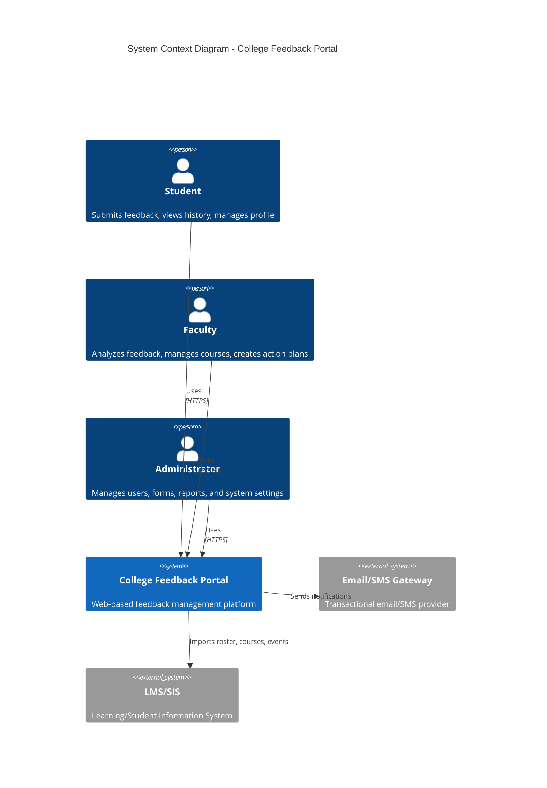
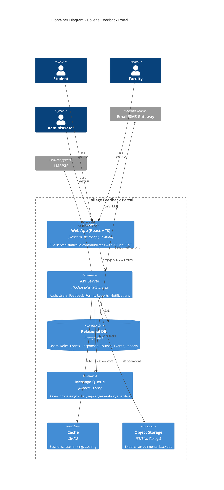
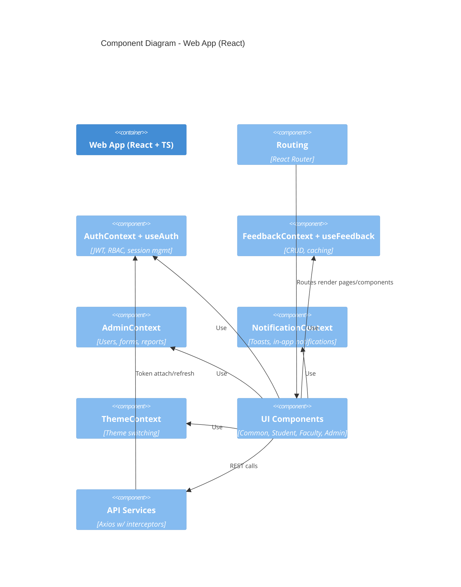
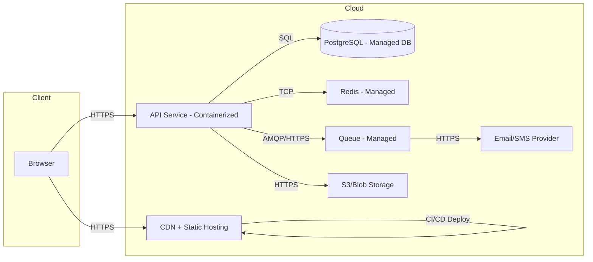

# Architecture Overview

This document provides a C4-style overview of the College Feedback Portal.

## System Context (C4: Level 1)

## Container Diagram (C4: Level 2)

## Component Diagram (C4: Level 3) - Frontend

## Deployment Diagram (C4: Level 4)

## Cross-cutting Concerns
- Authentication: JWT access + refresh, rotation, revocation, secure cookies optional.
- Authorization: RBAC with permissions mapped to routes and API scopes.
- Observability: OpenTelemetry traces, structured logs, metrics (latency, error rate), dashboards.
- Resilience: Retries, circuit breakers, timeouts, bulkheads.
- Performance: Code splitting, caching, pagination, indexing.
