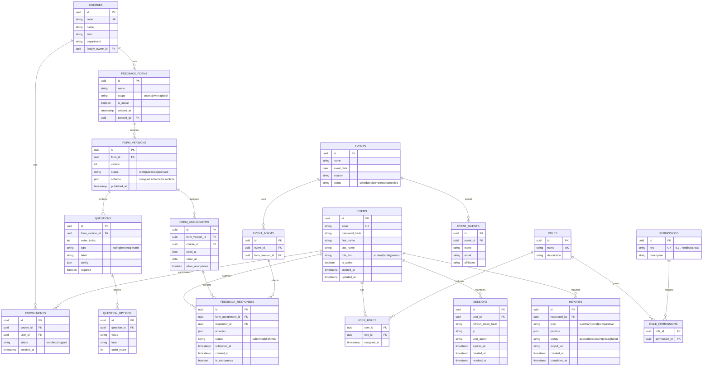

# Entity Relationship Diagram (ERD)

## Notes
- All `json` columns are validated server-side against TypeScript/JSON Schema.
- Soft-deletes via `is_active` or `status` where appropriate; also maintain audit trails.
- Indexes on foreign keys, `responses(form_assignment_id, responder_id)`, `sessions(user_id, expires_at)`, `enrollments(course_id, user_id)`.
